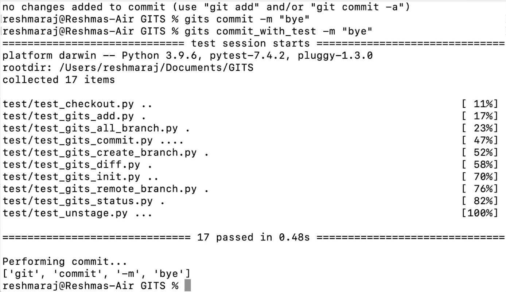
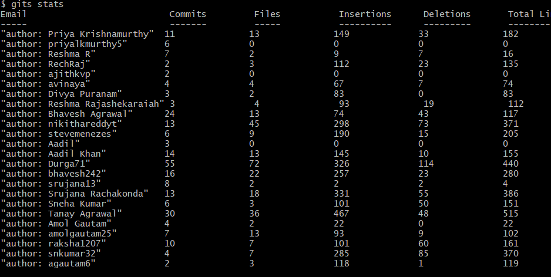

# GITS 
### GIT Simplified

### Installation Guidelines:
1. Clone the GITS repository  
2. Navigate inside GITS folder and enter the following command:   `pip install -r requirements.txt`  
3. Navigate inside the configurations folder and run the folllowing commands:   
- `chmod +x project_init.sh`   
- `./project_init.sh`   
- `source .bashrc`  
4. Run `gits hello_world` from any directory. If you end up getting a welcome msg you're good to go!  

### Supported functionality

#### gits pr_update
This functionality makes sure that the current branch is able to make a PR without much trouble ( conflict ). It makes sure that the current branch has the latest commit off master branch, and that the local master has all the commits from the upstream master. This helps in reducing merge conflicts

#### gits profile
This functionality allows the user to change the git account quickly with a single command. There are situations when a developer has a personal github account and a enterprise github account as well. Changing between these accounts is a little complicated. This functionality aims to simplify it.

#### gits rebase 
This is a highly simplified version of git rebase command. This interactive command asks for the branch that you want to rebase and automatically rebases it off master. This is the most common scenario. The original GIT rebase command is a little un-intuitive and there is always a confusion , about the source branch and the destination branch.  

#### gits reset
'Reset' intuitively means a HARD reset. This functionality does a HARD reset on your branch, and makes it even with the remote branch. This aims to simplify the confusion between HARD and the SOFT reset.  

#### gits set
This functionality sets the parent branch. 

#### gits upstream
This functionality changes the upstream with a single command. No need to manually remove the existing upstream, and adding a new upstream. This command will automatically change the upstream for the git repo. If there is any existing upstream , it will be overwritten.

#### gits super reset
Have you ever run into a situation, where you had to clone the repository again ? Yes, this functionality is exactly for that scenario. It will remove the current repository. It will clone it again, and add all the 'remote' to this freshly cloned repository. 

#### gits add 
Function that adds files as passed to the gits add command. Performs operation as similar to git add command

#### gits commit
It is a highly simplified version of git commit command. We have implemented a new functionality - such that a the unit tests are run before any commit (mentioned in next point).

#### gits commit_with_test
This is a slightly advanced version of git commit command. This commands checks for the success of the unit test cases, before performing the commit. If all the test cases are passed, the commit will be done successfully. In case of failure of the test cases, this command gives the user a choice to take a call on whether the commit needs to be done or it needs to be aborted.

Example:

#### gits create
This automatically checks out a new branch from local master , after pulling all the changes from the remote master to local master. The idea behind this is that this new branch should have all the latest commits before a developer starts working on them.

#### gits all-branch
This command lists all the branches on both local and remote repositories.

#### gits remote-branch
This command lists all the branches on remote repository.

#### gits init
Function that creates an empty Git repository or re-initializes an existing one. There are three versions of this function, 
* `gits init --url='cloning url': Clones the repository at url at current directory`
* `gits init: This variant creates a repository with a working directory so you can actually work`
* `gits init --bare: This variant creates a repository without a working directory`

#### gits logging
This logs all the commands executed by the user, and also stores the output of each command

#### gits push
This pushes all the local changes of origin to the branch specified. 

#### gits checkout
This command switches between two branches. The function takes branch name as input and returns True for successful execution or False otherwise with an exception.

#### gits unstage
This command moves files from staging area to the working directory. These untracked files will not be considered for the upcoming commits. The function filenames as input to move from staging area to working directory and returns True for successful execution or False with an exception.

#### gits describe
This command in Git is used to provide a human-readable name for a specific commit. It's often used to get a descriptive label for a commit, such as a version number or release name. This can be helpful for identifying and communicating the state of a particular commit in your Git repository.

#### gits commit_tree
This command produces a visual representation of the commit history that makes it easier to understand the branching and merging of different branches in a Git repository. This can be especially useful for complex projects with multiple contributors or when working with feature branches and merges. The graph lines connect commits to show the sequence of commits and how they are related, helping you to visualize the history of your project more clearly.

### Example Visualization:

#### gits stats
extends the functionality of Git by providing a command to view user statistics, including commit count, insertions, and deletions. It parses the Git log and presents the data in a tabular format, making it easy to analyze the contributions of different authors to a Git repository.

Usage: gits stats

#### gits tag
The 'gits tag' command extends the functionality of 'git tag' command in Git which is used to list all the tags (references to specific points in Git history) in a repository. Tags are typically used to mark important points, such as releases or milestones, in a project's history. Tags are commonly used to provide a human-readable and easily accessible reference to a specific commit.

Example:

#### gits tag <tag_name>
The gits tag <tag_name> command is used to create a new tag with a specific name at the current commit in a Git repository. This allows you to mark a significant point in your project's history, such as a software release or a specific version. Tags are lightweight and do not move as you make new commits.

Example:

#### gits checkout <tag_name>
The gits checkout <tag_name> command is used to switch the Git repository to a specific tagged commit. This means that it moves your working directory and HEAD (current branch) to the commit associated with the specified tag. It's a way to work on a specific version of your project, effectively creating a detached HEAD state. This is useful for inspecting, testing, or making changes related to a particular release or point in your project's history without affecting the current branch.

Example:

### pydoc implementation
We have tried to write as much documentation as possible. You can use pydoc to go through the documentation. 
For example if you want to go through all the documentation for all files in code/ directory, do the following: 

`cd code` 
`python3 -m pydoc -b `

This will open up a browser and you can see all the files. You can click on a particular file to access the documentation associated with that file.

Note: More functionality are being added to this project. Please refer to the 'issues' tab for more information. In case you want to contribute to this project , please refer to 'Contributing.md' file.

## Style Checker and Analyzer
We are using flake9 as our style checker and code analyzer. While contrivuting to this project, make sure you conform to norms dictated by flake8
### Flake8 
<b>Installation</b>
- `python<version> -m pip install flake8`

If you want Flake8 to be installed for your default Python installation, you can instead use:
- `python -m pip install flake8`

 <b>Using Flake8</b> 
  To start using Flake8, open an interactive shell and run one of the following,
- `flake8 path/to/code/to/check.py`
- `flake8 path/to/code/`

This repository is made for CSC 510 Software Engineering Course at NC State University.

Project Group 56 Team Members: 

* Ajith Kumar V P
* Priya Krishnamurthy
* Divya Puranam
* Reshma Rajashekaraiah
